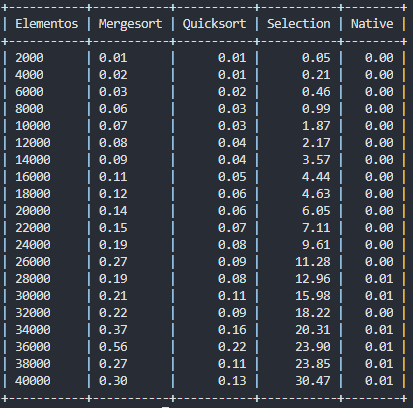

## Setup do projeto:

### Instalar pipenv:
```bash
    pip install pipenv
```
### Instalar dependência:
```bash
    pipenv install
```

### Executar o projeto:
```bash
    pipenv run python index.py
```

## Objetivo:
### Teste de velocidade de algoritmos de ordenação em uma marca de 30 segundos.
 
# Resultado dos testes:

